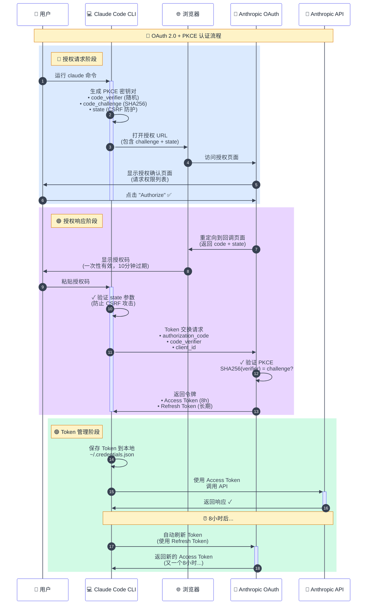

https://linux.do/t/topic/860911

## 1. 引言：一个关于"拼车"的想法

项目源于一个朴素的想法：与小伙伴"拼车"使用 Claude Code。

200 刀的 max 订阅不便宜，拼车能合理的分摊成本，又能和好友一起使用、讨论这个目前（我认为）最强大的 AI 编程工具，岂不快哉。

想要实现需求，最核心的两个问题：

- **Claude Code 客户端如何对用户账号进行认证？**
- **认证成功后，如何向 API 发起请求？**

这篇文章将详细解析 Claude Code CLI 的原生认证流程，带你一步步了解 OAuth 2.0 + PKCE 的实现细节。

> 实际上这与接入 L 站登录没什么区别。
>
> 建议 A 社立刻开放 L 站用户登录，免费使用 Opus!!!

## 2. OAuth 2.0 流程预备知识

### 2.1 三个关键角色

在进入 Claude Code 的认证流程前，我们需要先明确 OAuth 2.0 中的三个关键角色：

| 角色                                     | 在 Claude Code 场景中 | 职责                                               |
| ---------------------------------------- | --------------------- | -------------------------------------------------- |
| **资源所有者**<br>(Resource Owner)       | 你（用户）            | • 拥有 Anthropic 账号<br>• 决定是否授权            |
| **客户端**<br>(Client)                   | Claude Code CLI       | • 请求访问权限<br>• 使用获得的令牌调用 API         |
| **授权服务器**<br>(Authorization Server) | Anthropic OAuth 服务  | • 验证用户身份<br>• 颁发访问令牌<br>• 管理权限范围 |

理解这三方的角色关系是理解整个 OAuth 流程的关键。接下来的每个步骤，都是这三方之间的交互。

### 2.2 两大安全机制

#### 2.2.1 State 参数与 CSRF 防护

> 💡 **State 参数**：防止恶意网站偷偷让你授权给攻击者。

`state` 参数是 OAuth 2.0 中防止跨站请求伪造（CSRF）攻击的重要机制。

**CSRF 攻击原理**：
攻击者可能构造一个恶意的授权请求，诱导你点击，让你在不知情的情况下授权攻击者的应用访问你的账号。

**State 参数如何防护**：

1. 客户端生成一个随机的 `state` 值（[步骤一](#311-步骤一启动认证流程)）
2. 在授权请求中发送这个 `state` 值
3. 授权服务器在回调时原样返回 `state` 值（[步骤三](#321-步骤三回调页面与授权码获取)）
4. 客户端验证返回的 `state` 是否与发送的一致

如果 `state` 不匹配，说明这个回调可能来自攻击者，客户端会拒绝处理。

这就像取快递时的取件码——驿站小哥需要确定你的取件码，他们才会把快递给你。

#### 2.2.2 PKCE 安全机制

> 💡 **PKCE**：即使授权码被偷了，攻击者也无法使用。

PKCE（Proof Key for Code Exchange）是 OAuth 2.0 的安全增强机制，专门防止授权码被截获后的恶意利用。

**为什么授权码被截获很危险？**

在传统的 OAuth 流程中，如果攻击者通过网络监听、恶意软件或其他手段截获了授权码，他们可以：

- 使用截获的授权码向授权服务器请求访问令牌
- 获得完整的账号访问权限
- 消耗用户的资源配额
- 窃取敏感数据

这就像有人偷看了你的快递取件码，然后冒充你取走了包裹。

**PKCE 的工作原理复杂一些**：

1. **生成密钥对**（[步骤一](#311-步骤一启动认证流程)）：客户端生成一个随机字符串 `code_verifier`，然后计算其 SHA256 哈希值作为 `code_challenge`

   ```
   code_verifier = "dBjftJeZ4CVP-mB92K27uhbUJU1p1r_wW1gFWFOEjXk"  // 原始随机字符串，保存在本地
   code_challenge = SHA256(code_verifier) = "aM_o8LfwOVdvgSNkK3Gr4RLWS4olNGv4tuGBl3X3_Mo"  // 发送给服务器
   ```

2. **发送 code_challenge**（[步骤一](#311-步骤一启动认证流程)）：在授权请求中只发送 `code_challenge`，不发送 `code_verifier`

3. **验证身份**（[步骤四](#322-步骤四token-安全交换---pkce-的关键作用)）：Token 交换时提供 `code_verifier`，服务器验证：
   ```
   SHA256(code_verifier) === code_challenge
   ```

**为什么 PKCE 能够防护？**

PKCE 的巧妙之处在于：

- 攻击者即使截获了授权码，也没有原始的 `code_verifier`
- SHA256 是单向哈希函数，无法从 `code_challenge` 反推出 `code_verifier`
- 没有 `code_verifier`，就无法通过服务器的验证，Token 交换会失败

这就像银行的双重验证 —— 即使小偷拿到了你的银行卡（授权码），没有密码（verifier）也取不了钱。
虽然你最终要在 ATM 机上输入密码，但密码是通过安全的加密通道（HTTPS）直接传给银行的，而不是通过容易被窥视的浏览器重定向。

## 3. Claude Code CLI 认证流程详解

在深入每个步骤的细节之前，让我们先通过一张流程图了解整个 OAuth 认证的全貌：



这个流程展示了 Claude Code 如何通过 OAuth 2.0 + PKCE 安全地获取访问权限：

1. **授权请求阶段**（蓝色）：CLI 生成安全参数，引导用户在浏览器中完成授权
2. **授权响应阶段**（紫色）：用户授权后，CLI 使用授权码和 PKCE verifier 交换访问令牌
3. **Token 管理阶段**（绿色）：CLI 保存令牌并管理其生命周期，包括自动刷新

接下来，让我们详细了解每个步骤的具体实现。

### 3.1 授权请求阶段

#### 3.1.1 步骤一：启动认证流程

```bash
$ claude
```

当在 Claude Code CLI 中选择账号登录后，Claude Code 会生成一个 OAuth 授权链接并尝试在浏览器中打开。如果浏览器无法自动打开，CLI 会显示完整的授权 URL 供用户手动访问。


**OAuth URL 参数解析：**

| 类别     | 参数                    | 说明                                                          |
| -------- | ----------------------- | ------------------------------------------------------------- |
| **身份** | `client_id`             | Claude Code 的 OAuth 客户端 ID（所有 Claude Code 实例共用）   |
| **模式** | `code`                  | 启用授权码模式标识                                            |
| **模式** | `response_type`         | 指定 OAuth 流程类型为授权码模式                               |
| **权限** | `scope`                 | 请求的权限范围：创建组织 API 密钥、访问用户信息、执行推理请求 |
| **回调** | `redirect_uri`          | 授权成功后的回调地址                                          |
| **安全** | `state`                 | 防止 CSRF 攻击（[详见预备知识](#221-state-参数与-csrf-防护)） |
| **安全** | `code_challenge`        | PKCE 挑战码（[详见预备知识](#222-pkce-安全机制)）             |
| **安全** | `code_challenge_method` | PKCE 加密方法（SHA256）                                       |

这些参数共同构成了一个完整的授权请求。

这正是 OAuth 的核心价值：Claude Code 不需要存储你的密码，只需要通过授权，就能安全地访问你的账号资源。

#### 3.1.2 步骤二：浏览器授权页面

在浏览器中打开授权链接后，会跳转到 Anthropic 的 OAuth 授权页面：


在这个页面上，Anthropic 会明确展示 Claude Code 请求的权限范围（即上一步中的 scope 参数）。只有在你确认并点击"Authorize"后，Anthropic 才会颁发授权码。这确保了用户对授权过程的完全知情和控制。

### 3.2 授权响应阶段

#### 3.2.1 步骤三：回调页面与授权码获取

当用户在授权页面点击 "Authorize" 按钮后，浏览器会重定向到回调页面：


**关键流程解析：**

1. **浏览器重定向**：用户确认授权后，Anthropic 将浏览器重定向到回调地址：

   ```
   https://console.anthropic.com/oauth/code/callback?code=ac_2PJ...&state=1ejO...
   ```

2. **授权码颁发**：URL 参数中的 `code` 就是 Anthropic 颁发的授权码（Authorization Code）

   - 授权码是一次性的，有效期很短（通常 10 分钟）
   - 必须配合正确的 PKCE verifier 才能使用
   - 这是 OAuth 2.0 的核心安全设计：授权码本身不是访问令牌

3. **状态验证**：`state` 参数原样返回，Claude Code 会验证其是否与步骤一发送的一致（[详见预备知识](#221-state-参数与-csrf-防护)）

这一步中 Anthropic 给了你一张"取货凭证"（授权码）。这张凭证有效期很短，必须赶紧拿去换取真正的"通行证"（访问令牌）。

#### 3.2.2 步骤四：Token 安全交换 - PKCE 的关键作用

回到 CLI 界面，将授权码粘贴到命令行中，叮...登录成功!!!：


这一步中，实际上 CLI 收到授权码后，立即发起 Token 交换请求：

```
POST https://api.anthropic.com/oauth/token
{
  "grant_type": "authorization_code",
  "code": "ac_2PJ3kL5mN7qR9sT...",
  "client_id": "9d1c250a-e61b-44d9-88ed-5944d1962f5e",
  "code_verifier": "dBjftJeZ4CVP-mB92K27uhbUJU1p1r_wW1gFWFOEjXk",
  "redirect_uri": "https://console.anthropic.com/oauth/code/callback"
}
```

**PKCE 验证**：

此时 Anthropic 服务器会执行 PKCE 验证（[详见预备知识](#222-pkce-安全机制)）：

```
收到的 code_verifier = "dBjftJeZ4CVP-mB92K27uhbUJU1p1r_wW1gFWFOEjXk"
步骤一的 code_challenge = "aM_o8LfwOVdvgSNkK3Gr4RLWS4olNGv4tuGBl3X3_Mo"
验证：SHA256(code_verifier) === code_challenge ✓
```

只有验证通过，Token 交换才会成功。这确保了即使授权码被截获，攻击者也无法完成认证流程。

### 3.3 Token 管理阶段

#### 3.3.1 步骤五：获取访问令牌并本地存储

Token 交换验证通过后，Anthropic 返回访问令牌，Claude Code 将其存储到本地配置文件 `.credentials.json`：

```json
{
  "claudeAiOauth": {
    "accessToken": "sk-ant-oat01-...",
    "refreshToken": "sk-ant-ort01-...",
    "expiresAt": 1754945252465,
    "scopes": ["user:inference", "user:profile"],
    "subscriptionType": "max"
  }
}
```

| 字段               | 说明                             |
| ------------------ | -------------------------------- |
| `accessToken`      | API 调用令牌（短期，8 小时）     |
| `refreshToken`     | 刷新令牌（长期）                 |
| `expiresAt`        | accessToken 的过期时间戳（毫秒） |
| `scopes`           | 权限范围                         |
| `subscriptionType` | 订阅类型（`max` / `pro`）        |

至此，OAuth 认证流程完成！Claude Code 已经安全地获得了访问你 Anthropic 账号资源的"钥匙"，可以开始愉快地使用了。

#### 3.3.2 步骤六：Token 自动刷新机制

`accessToken` 的有效期为 8 小时，当 Claude Code 检测到令牌即将过期时，会自动使用 `refreshToken` 获取新的访问令牌。

**刷新请求**：

```
POST https://api.anthropic.com/oauth/token
{
  "grant_type": "refresh_token",
  "refresh_token": "sk-ant-ort01-...",
  "client_id": "9d1c250a-e61b-44d9-88ed-5944d1962f5e"
}
```

> **⚠️ 安全警告**
>
> `refreshToken` 就像你家的备用钥匙 —— 丢了它，别人就能一直进你家。
>
> 即使你改了密码，拿到 `refreshToken` 的人依然能持续访问你的 Claude 账号，消耗额度，窃取对话记录。
>
> **请务必**：
>
> - 不要分享 `.credentials.json` 文件
> - 不要提交令牌到 Git 仓库
> - 定期检查账号活动，发现异常立即撤销授权

## 4. 总结

看到这里，你已经完全掌握了 Claude Code CLI 的认证流程。

**Claude Code 用了三招保证安全**：

- PKCE：即使授权码被偷了也没用，因为小偷没有本地的密钥
- State：防止恶意网站偷偷让你授权
- 短期授权码：10 分钟就过期，用完就扔

**最重要的是**：保护好你的 `.credentials.json` 文件！这就是你家的钥匙，丢了就麻烦了。

理解了这套机制，不管是自己开发 CLI 工具，还是构建 API 网关来"拼车"，你都有了坚实的基础。

下篇文章我们聊聊怎么在 Web 环境里实现同样的认证流程，敬请期待！

具体代码：

```js
/**
 * OAuth助手工具
 * 基于claude-code-login.js中的OAuth流程实现
 */

const crypto = require("crypto");
const ProxyHelper = require("./proxyHelper");
const axios = require("axios");
const logger = require("./logger");

// OAuth 配置常量 - 从claude-code-login.js提取
const OAUTH_CONFIG = {
  AUTHORIZE_URL: "https://claude.ai/oauth/authorize",
  TOKEN_URL: "https://console.anthropic.com/v1/oauth/token",
  CLIENT_ID: "9d1c250a-e61b-44d9-88ed-5944d1962f5e",
  REDIRECT_URI: "https://console.anthropic.com/oauth/code/callback",
  SCOPES: "org:create_api_key user:profile user:inference",
  SCOPES_SETUP: "user:inference", // Setup Token 只需要推理权限
};

/**
 * 生成随机的 state 参数
 * @returns {string} 随机生成的 state (base64url编码)
 */
function generateState() {
  return crypto.randomBytes(32).toString("base64url");
}

/**
 * 生成随机的 code verifier（PKCE）
 * @returns {string} base64url 编码的随机字符串
 */
function generateCodeVerifier() {
  return crypto.randomBytes(32).toString("base64url");
}

/**
 * 生成 code challenge（PKCE）
 * @param {string} codeVerifier - code verifier 字符串
 * @returns {string} SHA256 哈希后的 base64url 编码字符串
 */
function generateCodeChallenge(codeVerifier) {
  return crypto.createHash("sha256").update(codeVerifier).digest("base64url");
}

/**
 * 生成授权 URL
 * @param {string} codeChallenge - PKCE code challenge
 * @param {string} state - state 参数
 * @returns {string} 完整的授权 URL
 */
function generateAuthUrl(codeChallenge, state) {
  const params = new URLSearchParams({
    code: "true",
    client_id: OAUTH_CONFIG.CLIENT_ID,
    response_type: "code",
    redirect_uri: OAUTH_CONFIG.REDIRECT_URI,
    scope: OAUTH_CONFIG.SCOPES,
    code_challenge: codeChallenge,
    code_challenge_method: "S256",
    state,
  });

  return `${OAUTH_CONFIG.AUTHORIZE_URL}?${params.toString()}`;
}

/**
 * 生成OAuth授权URL和相关参数
 * @returns {{authUrl: string, codeVerifier: string, state: string, codeChallenge: string}}
 */
function generateOAuthParams() {
  const state = generateState();
  const codeVerifier = generateCodeVerifier();
  const codeChallenge = generateCodeChallenge(codeVerifier);

  const authUrl = generateAuthUrl(codeChallenge, state);

  return {
    authUrl,
    codeVerifier,
    state,
    codeChallenge,
  };
}

/**
 * 生成 Setup Token 授权 URL
 * @param {string} codeChallenge - PKCE code challenge
 * @param {string} state - state 参数
 * @returns {string} 完整的授权 URL
 */
function generateSetupTokenAuthUrl(codeChallenge, state) {
  const params = new URLSearchParams({
    code: "true",
    client_id: OAUTH_CONFIG.CLIENT_ID,
    response_type: "code",
    redirect_uri: OAUTH_CONFIG.REDIRECT_URI,
    scope: OAUTH_CONFIG.SCOPES_SETUP,
    code_challenge: codeChallenge,
    code_challenge_method: "S256",
    state,
  });

  return `${OAUTH_CONFIG.AUTHORIZE_URL}?${params.toString()}`;
}

/**
 * 生成Setup Token授权URL和相关参数
 * @returns {{authUrl: string, codeVerifier: string, state: string, codeChallenge: string}}
 */
function generateSetupTokenParams() {
  const state = generateState();
  const codeVerifier = generateCodeVerifier();
  const codeChallenge = generateCodeChallenge(codeVerifier);

  const authUrl = generateSetupTokenAuthUrl(codeChallenge, state);

  return {
    authUrl,
    codeVerifier,
    state,
    codeChallenge,
  };
}

/**
 * 创建代理agent（使用统一的代理工具）
 * @param {object|null} proxyConfig - 代理配置对象
 * @returns {object|null} 代理agent或null
 */
function createProxyAgent(proxyConfig) {
  return ProxyHelper.createProxyAgent(proxyConfig);
}

/**
 * 使用授权码交换访问令牌
 * @param {string} authorizationCode - 授权码
 * @param {string} codeVerifier - PKCE code verifier
 * @param {string} state - state 参数
 * @param {object|null} proxyConfig - 代理配置（可选）
 * @returns {Promise<object>} Claude格式的token响应
 */
async function exchangeCodeForTokens(
  authorizationCode,
  codeVerifier,
  state,
  proxyConfig = null
) {
  // 清理授权码，移除URL片段
  const cleanedCode =
    authorizationCode.split("#")[0]?.split("&")[0] ?? authorizationCode;

  const params = {
    grant_type: "authorization_code",
    client_id: OAUTH_CONFIG.CLIENT_ID,
    code: cleanedCode,
    redirect_uri: OAUTH_CONFIG.REDIRECT_URI,
    code_verifier: codeVerifier,
    state,
  };

  // 创建代理agent
  const agent = createProxyAgent(proxyConfig);

  try {
    if (agent) {
      logger.info(
        `🌐 Using proxy for OAuth token exchange: ${ProxyHelper.maskProxyInfo(
          proxyConfig
        )}`
      );
    } else {
      logger.debug("🌐 No proxy configured for OAuth token exchange");
    }

    logger.debug("🔄 Attempting OAuth token exchange", {
      url: OAUTH_CONFIG.TOKEN_URL,
      codeLength: cleanedCode.length,
      codePrefix: `${cleanedCode.substring(0, 10)}...`,
      hasProxy: !!proxyConfig,
      proxyType: proxyConfig?.type || "none",
    });

    const response = await axios.post(OAUTH_CONFIG.TOKEN_URL, params, {
      headers: {
        "Content-Type": "application/json",
        "User-Agent": "claude-cli/1.0.81 (external, cli)",
        Accept: "application/json, text/plain, */*",
        "Accept-Language": "en-US,en;q=0.9",
        Referer: "https://claude.ai/",
        Origin: "https://claude.ai",
      },
      httpsAgent: agent,
      timeout: 30000,
    });

    // 记录完整的响应数据到专门的认证详细日志
    logger.authDetail("OAuth token exchange response", response.data);

    // 记录简化版本到主日志
    logger.info(
      "📊 OAuth token exchange response (analyzing for subscription info):",
      {
        status: response.status,
        hasData: !!response.data,
        dataKeys: response.data ? Object.keys(response.data) : [],
      }
    );

    logger.success("✅ OAuth token exchange successful", {
      status: response.status,
      hasAccessToken: !!response.data?.access_token,
      hasRefreshToken: !!response.data?.refresh_token,
      scopes: response.data?.scope,
      // 尝试提取可能的套餐信息字段
      subscription: response.data?.subscription,
      plan: response.data?.plan,
      tier: response.data?.tier,
      accountType: response.data?.account_type,
      features: response.data?.features,
      limits: response.data?.limits,
    });

    const { data } = response;

    // 返回Claude格式的token数据，包含可能的套餐信息
    const result = {
      accessToken: data.access_token,
      refreshToken: data.refresh_token,
      expiresAt: (Math.floor(Date.now() / 1000) + data.expires_in) * 1000,
      scopes: data.scope
        ? data.scope.split(" ")
        : ["user:inference", "user:profile"],
      isMax: true,
    };

    // 如果响应中包含套餐信息，添加到返回结果中
    if (data.subscription || data.plan || data.tier || data.account_type) {
      result.subscriptionInfo = {
        subscription: data.subscription,
        plan: data.plan,
        tier: data.tier,
        accountType: data.account_type,
        features: data.features,
        limits: data.limits,
      };
      logger.info(
        "🎯 Found subscription info in OAuth response:",
        result.subscriptionInfo
      );
    }

    return result;
  } catch (error) {
    // 处理axios错误响应
    if (error.response) {
      // 服务器返回了错误状态码
      const { status } = error.response;
      const errorData = error.response.data;

      logger.error("❌ OAuth token exchange failed with server error", {
        status,
        statusText: error.response.statusText,
        headers: error.response.headers,
        data: errorData,
        codeLength: cleanedCode.length,
        codePrefix: `${cleanedCode.substring(0, 10)}...`,
      });

      // 尝试从错误响应中提取有用信息
      let errorMessage = `HTTP ${status}`;

      if (errorData) {
        if (typeof errorData === "string") {
          errorMessage += `: ${errorData}`;
        } else if (errorData.error) {
          errorMessage += `: ${errorData.error}`;
          if (errorData.error_description) {
            errorMessage += ` - ${errorData.error_description}`;
          }
        } else {
          errorMessage += `: ${JSON.stringify(errorData)}`;
        }
      }

      throw new Error(`Token exchange failed: ${errorMessage}`);
    } else if (error.request) {
      // 请求被发送但没有收到响应
      logger.error("❌ OAuth token exchange failed with network error", {
        message: error.message,
        code: error.code,
        hasProxy: !!proxyConfig,
      });
      throw new Error(
        "Token exchange failed: No response from server (network error or timeout)"
      );
    } else {
      // 其他错误
      logger.error("❌ OAuth token exchange failed with unknown error", {
        message: error.message,
        stack: error.stack,
      });
      throw new Error(`Token exchange failed: ${error.message}`);
    }
  }
}

/**
 * 解析回调 URL 或授权码
 * @param {string} input - 完整的回调 URL 或直接的授权码
 * @returns {string} 授权码
 */
function parseCallbackUrl(input) {
  if (!input || typeof input !== "string") {
    throw new Error("请提供有效的授权码或回调 URL");
  }

  const trimmedInput = input.trim();

  // 情况1: 尝试作为完整URL解析
  if (
    trimmedInput.startsWith("http://") ||
    trimmedInput.startsWith("https://")
  ) {
    try {
      const urlObj = new URL(trimmedInput);
      const authorizationCode = urlObj.searchParams.get("code");

      if (!authorizationCode) {
        throw new Error("回调 URL 中未找到授权码 (code 参数)");
      }

      return authorizationCode;
    } catch (error) {
      if (error.message.includes("回调 URL 中未找到授权码")) {
        throw error;
      }
      throw new Error("无效的 URL 格式，请检查回调 URL 是否正确");
    }
  }

  // 情况2: 直接的授权码（可能包含URL fragments）
  // 参考claude-code-login.js的处理方式：移除URL fragments和参数
  const cleanedCode = trimmedInput.split("#")[0]?.split("&")[0] ?? trimmedInput;

  // 验证授权码格式（Claude的授权码通常是base64url格式）
  if (!cleanedCode || cleanedCode.length < 10) {
    throw new Error("授权码格式无效，请确保复制了完整的 Authorization Code");
  }

  // 基本格式验证：授权码应该只包含字母、数字、下划线、连字符
  const validCodePattern = /^[A-Za-z0-9_-]+$/;
  if (!validCodePattern.test(cleanedCode)) {
    throw new Error(
      "授权码包含无效字符，请检查是否复制了正确的 Authorization Code"
    );
  }

  return cleanedCode;
}

/**
 * 使用授权码交换Setup Token
 * @param {string} authorizationCode - 授权码
 * @param {string} codeVerifier - PKCE code verifier
 * @param {string} state - state 参数
 * @param {object|null} proxyConfig - 代理配置（可选）
 * @returns {Promise<object>} Claude格式的token响应
 */
async function exchangeSetupTokenCode(
  authorizationCode,
  codeVerifier,
  state,
  proxyConfig = null
) {
  // 清理授权码，移除URL片段
  const cleanedCode =
    authorizationCode.split("#")[0]?.split("&")[0] ?? authorizationCode;

  const params = {
    grant_type: "authorization_code",
    client_id: OAUTH_CONFIG.CLIENT_ID,
    code: cleanedCode,
    redirect_uri: OAUTH_CONFIG.REDIRECT_URI,
    code_verifier: codeVerifier,
    state,
    expires_in: 31536000, // Setup Token 可以设置较长的过期时间
  };

  // 创建代理agent
  const agent = createProxyAgent(proxyConfig);

  try {
    if (agent) {
      logger.info(
        `🌐 Using proxy for Setup Token exchange: ${ProxyHelper.maskProxyInfo(
          proxyConfig
        )}`
      );
    } else {
      logger.debug("🌐 No proxy configured for Setup Token exchange");
    }

    logger.debug("🔄 Attempting Setup Token exchange", {
      url: OAUTH_CONFIG.TOKEN_URL,
      codeLength: cleanedCode.length,
      codePrefix: `${cleanedCode.substring(0, 10)}...`,
      hasProxy: !!proxyConfig,
      proxyType: proxyConfig?.type || "none",
    });

    const response = await axios.post(OAUTH_CONFIG.TOKEN_URL, params, {
      headers: {
        "Content-Type": "application/json",
        "User-Agent": "claude-cli/1.0.81 (external, cli)",
        Accept: "application/json, text/plain, */*",
        "Accept-Language": "en-US,en;q=0.9",
        Referer: "https://claude.ai/",
        Origin: "https://claude.ai",
      },
      httpsAgent: agent,
      timeout: 30000,
    });

    // 记录完整的响应数据到专门的认证详细日志
    logger.authDetail("Setup Token exchange response", response.data);

    // 记录简化版本到主日志
    logger.info(
      "📊 Setup Token exchange response (analyzing for subscription info):",
      {
        status: response.status,
        hasData: !!response.data,
        dataKeys: response.data ? Object.keys(response.data) : [],
      }
    );

    logger.success("✅ Setup Token exchange successful", {
      status: response.status,
      hasAccessToken: !!response.data?.access_token,
      scopes: response.data?.scope,
      // 尝试提取可能的套餐信息字段
      subscription: response.data?.subscription,
      plan: response.data?.plan,
      tier: response.data?.tier,
      accountType: response.data?.account_type,
      features: response.data?.features,
      limits: response.data?.limits,
    });

    const { data } = response;

    // 返回Claude格式的token数据，包含可能的套餐信息
    const result = {
      accessToken: data.access_token,
      refreshToken: "",
      expiresAt: (Math.floor(Date.now() / 1000) + data.expires_in) * 1000,
      scopes: data.scope
        ? data.scope.split(" ")
        : ["user:inference", "user:profile"],
      isMax: true,
    };

    // 如果响应中包含套餐信息，添加到返回结果中
    if (data.subscription || data.plan || data.tier || data.account_type) {
      result.subscriptionInfo = {
        subscription: data.subscription,
        plan: data.plan,
        tier: data.tier,
        accountType: data.account_type,
        features: data.features,
        limits: data.limits,
      };
      logger.info(
        "🎯 Found subscription info in Setup Token response:",
        result.subscriptionInfo
      );
    }

    return result;
  } catch (error) {
    // 使用与标准OAuth相同的错误处理逻辑
    if (error.response) {
      const { status } = error.response;
      const errorData = error.response.data;

      logger.error("❌ Setup Token exchange failed with server error", {
        status,
        statusText: error.response.statusText,
        data: errorData,
        codeLength: cleanedCode.length,
        codePrefix: `${cleanedCode.substring(0, 10)}...`,
      });

      let errorMessage = `HTTP ${status}`;
      if (errorData) {
        if (typeof errorData === "string") {
          errorMessage += `: ${errorData}`;
        } else if (errorData.error) {
          errorMessage += `: ${errorData.error}`;
          if (errorData.error_description) {
            errorMessage += ` - ${errorData.error_description}`;
          }
        } else {
          errorMessage += `: ${JSON.stringify(errorData)}`;
        }
      }

      throw new Error(`Setup Token exchange failed: ${errorMessage}`);
    } else if (error.request) {
      logger.error("❌ Setup Token exchange failed with network error", {
        message: error.message,
        code: error.code,
        hasProxy: !!proxyConfig,
      });
      throw new Error(
        "Setup Token exchange failed: No response from server (network error or timeout)"
      );
    } else {
      logger.error("❌ Setup Token exchange failed with unknown error", {
        message: error.message,
        stack: error.stack,
      });
      throw new Error(`Setup Token exchange failed: ${error.message}`);
    }
  }
}

/**
 * 格式化为Claude标准格式
 * @param {object} tokenData - token数据
 * @returns {object} claudeAiOauth格式的数据
 */
function formatClaudeCredentials(tokenData) {
  return {
    claudeAiOauth: {
      accessToken: tokenData.accessToken,
      refreshToken: tokenData.refreshToken,
      expiresAt: tokenData.expiresAt,
      scopes: tokenData.scopes,
      isMax: tokenData.isMax,
    },
  };
}

module.exports = {
  OAUTH_CONFIG,
  generateOAuthParams,
  generateSetupTokenParams,
  exchangeCodeForTokens,
  exchangeSetupTokenCode,
  parseCallbackUrl,
  formatClaudeCredentials,
  generateState,
  generateCodeVerifier,
  generateCodeChallenge,
  generateAuthUrl,
  generateSetupTokenAuthUrl,
  createProxyAgent,
};
```
